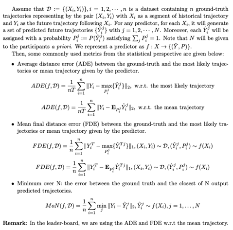

[TOC]

# Metrics for the “Regular" and "Generalizability" tracks of single agent prediction in the NeurIPS20 stage.

Note that for metrics of the “Regular" and "Generalizability" tracks of the single agent prediction in the **ICCV21** stage, please check https://github.com/interaction-dataset/INTERPRET_challenge_multi-agent.

# Python Scripts for the “Regular" and "Generalizability" tracks of the INTERPRET Competition

* These scripts assist you to process the INTERACTION Dataset into segments that can be directly used for training, validation and test in the “Regular" and "Generalizability" tracks in the INTERPRET challenge.
* The challenge is based on the INTERACTION dataset. For details about and access to the dataset, visit https://interaction-dataset.com/
* If you want to visualize the INTERACTION dataset, please refer to the github at https://github.com/interaction-dataset/interaction-dataset
* `python3` is supported

## Participating the INTERPRET challenge

[The INTERPRET challenge] (http://challenge.interaction-dataset.com/prediction-challenge/intro)) includes three tracks: 

* Regular track: in this track, you will train your prediction model based on the released data. The test set in this track is sampled on the **same** traffic scenarios (e.g., maps and traffic conditions) as the released data. You will be given the observations of the test set, and submit the prediction results as csv files to performance evaluation.
* Generalizability track: in this track, you will train your prediction model based on the released data. The test set in this track is sampled on **different and new** traffic scenarios (e.g., maps and traffic conditions) compared to the released data. You will be given the observations and maps of the test set, and submit the prediction results as csv files to performance evaluation.
* Closed-loop track: this is a track that aims to evaluate the performance of prediction algorithms in a "prediction-->planning" pipeline so that the impacts of predictors to the closed-loop performance can be evaluated. In this track, you will train your prediction model based on the released data, and submit the model as docker images. We will run your predictor in our simulator on multiple scenarios selected on the **same** traffic scenarios as the release data to evaluate its performance. Virtual, dynamic, and responsive agents will be included in the simulator. 

For detailed instructions for the "Closed-loop" track, please visit [INTERPRET_challenge_Closed_loop](https://github.com/interaction-dataset/INTERPRET_challenge_Closed_loop).

## Required Python Packages
* `csv`: for reading the csv track files
* `numpy`, `os`,  `sys`,  `functools`, `shutil` and`argparse` for processing the data

## Prepare Training Dataset for the INTERPRET Challenge

- copy/download the INTERACTION drone data into the right place
  - copy/download the track files into the folder `recorded_trackfiles`, keep one folder per scenario, as in your download
  - copy/download the maps into the folder `maps`
  - copy/download the suggested split .txt file ( validation-set-list_INTERACTION-dataset_v1.txt ) for the train and validation set into the folder `recorded_trackfiles`
  - your folder structure should look like in [folder-structure.md](doc/folder-structure.md)
- to split all track files into train and validation subfolders
  - run `./split_train_val_script.py <path_to_the_suggested_split_txt_file> <path_to_the_recorded_trackfiles> ` from folder `python` to split the trackfiles in the corresponding scenarios into two subfolders  `train`  and  `val` . (Internal note: the original csv files in the folder will be moved into the two newly created subfolders)
- to prepare the data into segments that can be directly utilized for the INTERPRET prediction
  - run `./segment_data.py <options> <path_to_folder_or_file_from_scenario_folder> number_of_frames_in_segments gap_frames_between_segments` from folder `python`
    - If users choose  `option=default`,  all trackfiles in both the  `train`  and  `val` subfolders in all scenarios will be segmented. The segmented csv files will be saved in newly created subfolders  `segmented` in corresponding train and validation folders. In the meanwhile, a folder `sorted` will also be generated in the  `train`  and  `val` subfolders which contains the csv files that are sorted based on the frame_id instead of the track_id in the file.
    - If users choose  `option=dir `, and specify the  <path_to_folder_or_file_from_scenario_folder> as a folder, then all csv files under this folder will be segmented, saved in a newly created subfolder `segmented`. If users choose  `option=file `, and specify ` <path_to_folder_or_file_from_scenario_folder>` as a .csv file, then the csv file will be segmented, saved in the subfolder  `segmented`.
    - All the segmented track files will follow the names of the original csv files.
- to split all track files and prepare all data into segments
  - from the  `python` folder, run `./split_train_val_script.py <path_to_the_suggested_split_txt_file> <path_to_the_recorded_trackfiles> `
  - from the `python` folder, run `./segment_data.py default <path_to_recorded_track_files> number_of_frames_in_segments gap_frames_between_segments` to split all the train and validation sets for all scenarios and segment all track files.  The first parameter `number_of_frames_in_segments ` determines how many frames (including both historical and predicted frames) are contained in each training case, and users can decide the length of historical frames and predicted frames as they need. The second ` gap_frames_between_segments` defines the gap between two successive test cases with a same  ` agent`. Typically, you should set   ` gap_frames_between_segments > number_of_frames_in_segments `  to avoid overlaps between different test cases. Moreover, in the segmented files, there is one extra column compared to the original track files, i.e., the  ` agent_role` column. If ` agent_role="agent"`, then that agent will be the one whose future trajectories need to be predicted, and all surronding vehicles will be marked as ` others`.

Note: The segmentation process will take a while, so please be patient.

